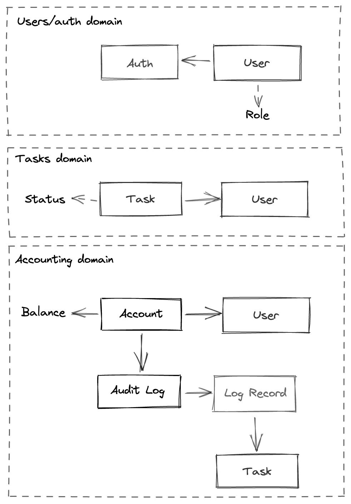
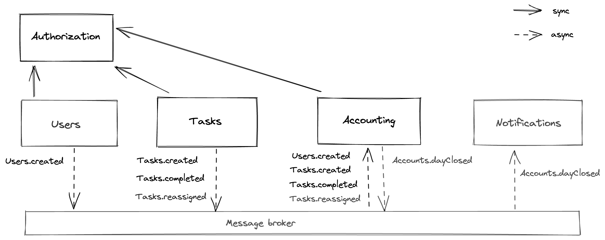

# aTES

## ES

**Register user flow**

- Actor: user
- Command: register user
- Data: user data
- Event: Users.created [CUD]
    
- Actor: Users.created event
- Command: create user account
- Data: user data
- Event: ???
    
- Actor: Users.created event 
- Command: create user auth data
- Data: user auth data
- Event: ???

**Login user flow**

- Actor: user 
- Command: auth user
- Data: login/password
- Event: ???

**Create task flow**

- Actor: manager
- Command: create task
- Data: task data
- Event: Tasks.created
    
- Actor: Tasks.created event
- Command: update balance / audit
- Data: userID, taskID
- Event: ???

**Complete task flow**

- Actor: user  
- Command: complete task
- Data: userID, taskID
- Event: Tasks.completed
    
- Actor: Tasks.completed event
- Command: update balance / audit
- Data: userID, taskID 
- Event: ???

**Reassign tasks flow**

- Actor: manager 
- Command: reassign tasks
- Data: ???
- Event: Tasks.reassigned
    
- Actor: Tasks.reassigned event
- Command: update balances / audit
- Data: List of tuples (userID, [taskID's])
- Event: ???

**Close day flow**

- Actor: Scheduled task  
- Command: close the day
- Data: ???
- Event: Accounts.dayClosed
    
- Actor: Accouts.dayClosed
- Command: send email
- Data: day summary + user data
- Event: ???

### Модель данных

В каждом домене есть инфа о юзере, самая полная - в Users домене. В Tasks и Accounting достаточно знать ID юзера и имя (для отображения)

Инфа о тасках дублируется в Accounting для аудит лога.

### Сервисы и связи между ними

### CUD События

Единственное CUD событие - создание пользователя в системе (Users.created) 
CUD событиями так же могли бы быть операции над тасками/юзерами, вроде обновление описание таски или имени юзера, но таких событий нету в бизнес требованиях, поэтому я их не описывал.
