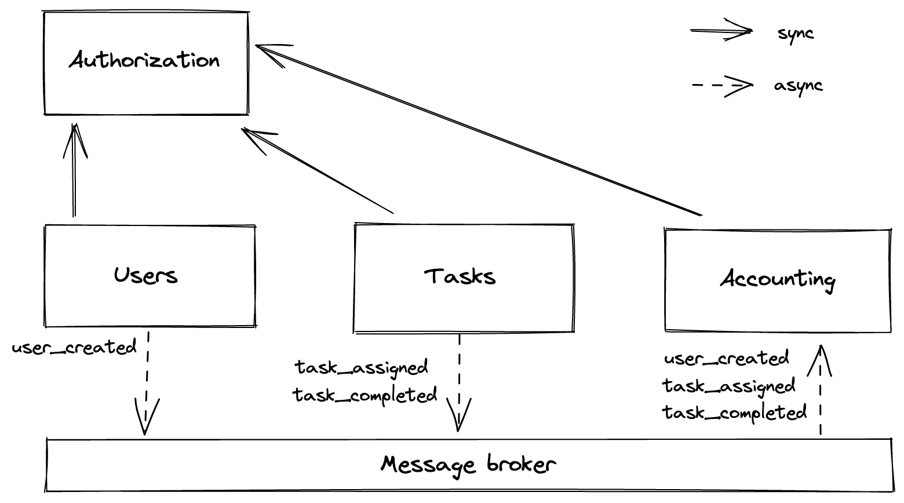

# aTES

## Сервисы:

**Auth** - отвечает за аутентификацию/авторизацию для всех остальных сервисов  
**Users** - CRUD для пользователей системы  
**Tasks** - CRUD для тасок + логика для реассайна  
**Accounting** - хранит балансы каждого пользователя и общий баланс компании + аудит лог  

На диаграме изображена схема коммуникаций сервисов. Запросы к auth - синхронные, все остальное - сообщениями через брокера.

## Сообщения:

**user_created** (user_id) - Создает аккаунт юзера в аккаунтинг сервисе  
**task_assigned** (user_id, task_id, task_fee) - Обновляет баланс юзера вычитая из него task_fee. Обновляет баланс компании, прибавляя к нему task_fee  
**task_completed** (user_id, task_id, task_cost) - Обновляет баланс юзера прибавляя к нему task_cost. Обновляет баланс компании, вычитая из него task_cost  

При сбоях в сети, персистентный брокер по идее не должен терять сообщения. Когда связь восстановится, сообщения должны будут быть доставлены до сервисов. Если потеряется связь с auth сервисом, нужно возвращать ошибку после пары ретраев.

TODO:
- Идемпотентность/дедупликация сообщений
- API